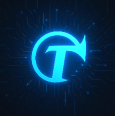

# Image Interceptor — AI

> "Not just a filtering tool, but an AI partner for creating a safe digital environment."
> 

---

## Overview

This repository is dedicated to **AI model development for Image Interceptor**.

It focuses on building and refining ConvNeXt- and YOLO-based models for harmful image filtering,

with the goal of achieving **real-time inference** and **lightweight deployment**.

---

## Key Objectives

- **Develop real-time harmful image detection models**
- **Enable lightweight ONNX conversion and CPU inference**
- **Advance high-performance AI research for safer digital environments**

---

## Detection Categories

- **Nudity**
- **Violence**
- **Self-harm**
- **Crime**

---

## AI Model Design

- **Classifier** → ConvNeXt family (Tiny/Small/Base): harmful vs. safe classification
- **Detector** → YOLO: localization and analysis of harmful elements
- **Target Performance**
    - mAP ≥ **0.80**
    - Real-time inference **P95 ≤ 300ms** (CPU/ONNX)

---

## AI Enhancement Strategy

- **Model Optimization**: ONNX export, quantization, CPU-friendly acceleration
- **Evaluation Metrics**: AUC, F1-score, Latency (P50/P95)

---

## AI Lead

| Name | Role | GitHub |
| --- | --- | --- |
| Jeong-Ah Yoon | Full ownership: model design · training · inference pipeline | [@jjyoon012-git](https://github.com/jjyoon012-git) |

---

## Motto

> “We are not just a filtering tool.
> 
> 
> We are your **AI partner** for creating a safe and trusted digital environment.”
>
